# Parcial 3 - OTM 106

---

**Autor:** Aillón Cardozo, Marshel
**Materia:** OTM 106  
**Fecha:** 25/09/2025

## Descripción

Este proyecto automatiza la generación de gráficas a partir de datos en Excel usando Python. Lee un archivo Excel con 6 hojas de datos y genera automáticamente gráficas de barras y pastel según el tipo de datos.

## ¿Qué hace el script?

El script `graficar.py`:
- Lee el archivo `datos/ejemplo.xlsx`
- Identifica automáticamente el tipo de gráfica por el nombre de la hoja (Barras1, Barras2, Barras3, Pastel1, Pastel2, Pastel3)
- Genera gráficas en formato PNG
- Guarda todas las gráficas en la carpeta `graficas/`

## Instalación y ejecución

### 1. Clonar el repositorio
```bash
git clone https://github.com/marshelaillon/otm_106_3er_parcial
cd otm_106_3er_parcial
```

### 2. Crear y activar entorno virtual
```bash
# Crear entorno virtual
python -m venv venv

# Activar entorno virtual (Windows)
venv\Scripts\activate

# Activar entorno virtual (Mac/Linux)
source venv/bin/activate
```

### 3. Instalar dependencias
```bash
pip install -r requirements.txt
```

### 4. Ejecutar el script
```bash
python3 graficar.py
```

## Datos incluidos

El archivo Excel contiene datos ficticios en 6 hojas:

**Gráficas de Barras:**
- **Barras1**: Ventas mensuales

<figure style="text-align: center;">
    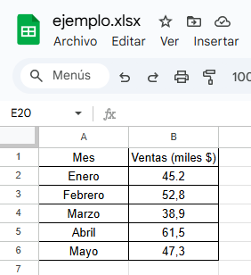
</figure>

- **Barras2**: Productos más vendidos  

<figure style="text-align: center;">
    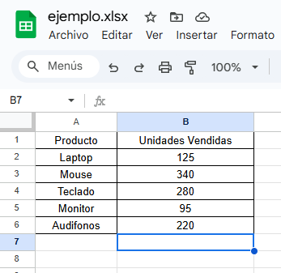
</figure>

- **Barras3**: Calificaciones por materia

<figure style="text-align: center;">
    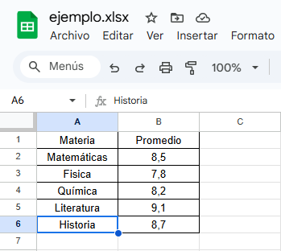
</figure>

**Gráficas de Pastel:**
- **Pastel1**: Distribución de edades

<figure style="text-align: center;">
    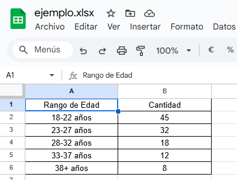
</figure>

- **Pastel2**: Preferencias de transporte

<figure style="text-align: center;">
    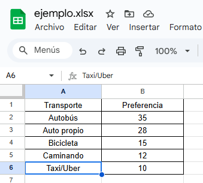
</figure>

- **Pastel3**: Tipos de dispositivos

<figure style="text-align: center;">
    
</figure>

## Resultado

Después de ejecutar el script se generan 6 gráficas en la carpeta `graficas/`:
- 3 gráficas de barras con títulos y ejes
- 3 gráficas de pastel con porcentajes y leyendas

## Tecnologías utilizadas

- **Python**
- **Pandas**: Lectura de datos Excel
- **Matplotlib**: Generación de gráficas

## Screenshots

##### Pre-ejecución del script

<figure style="text-align: center;">
    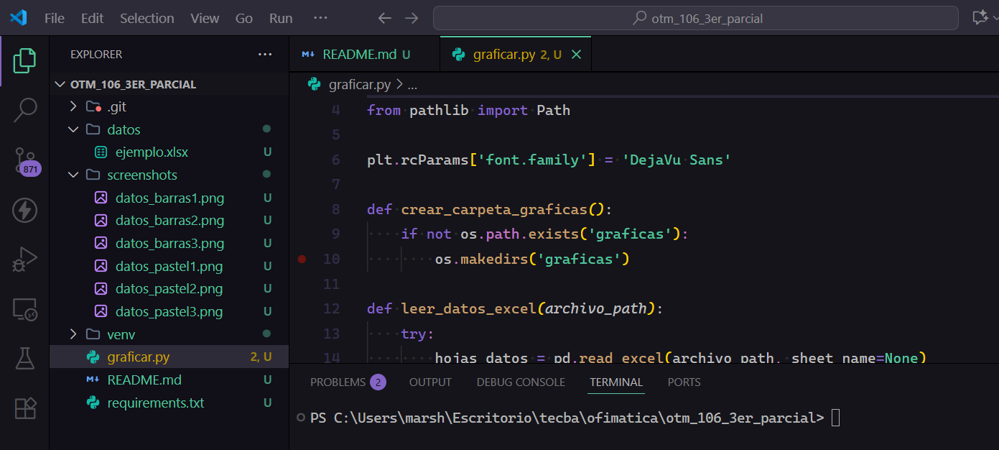
</figure>

##### Pre-ejecución del script

<figure style="text-align: center;">
    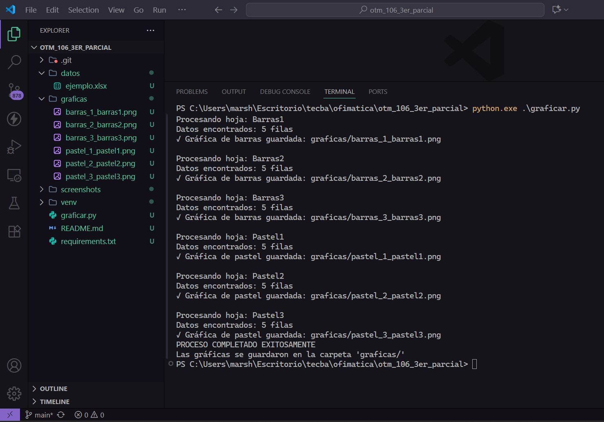
</figure>

## Gráficas generadas

#### Gráficas de barras

<figure style="text-align: center;">
    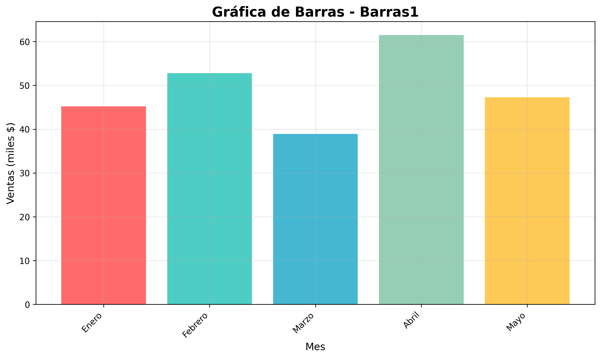
    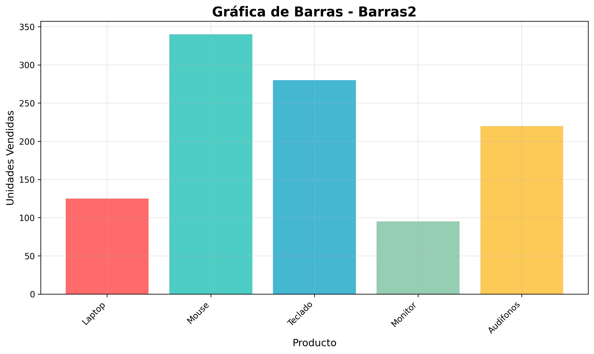
    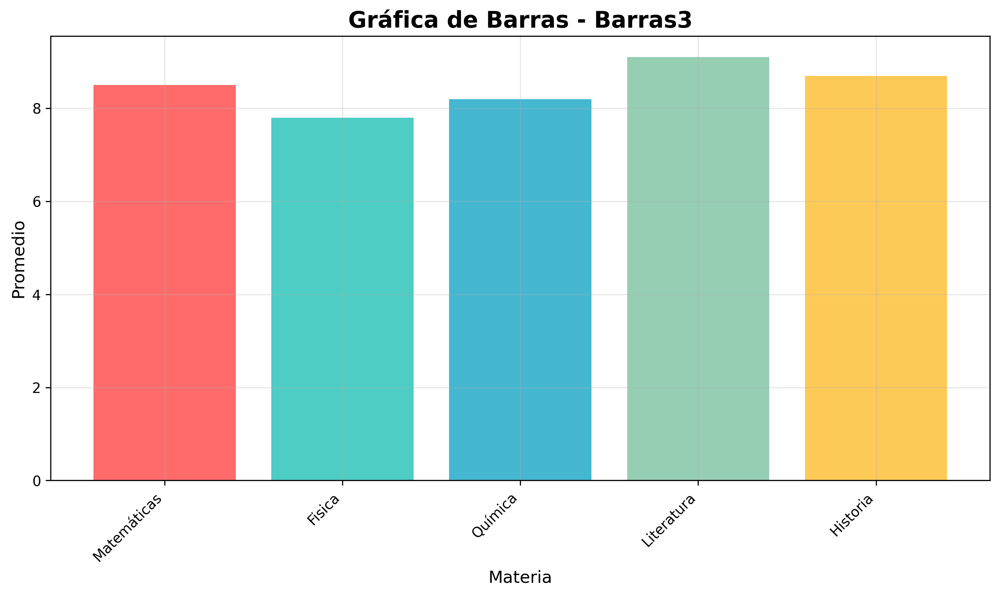
</figure>

#### Gráficas pastel

<figure style="text-align: center;">
    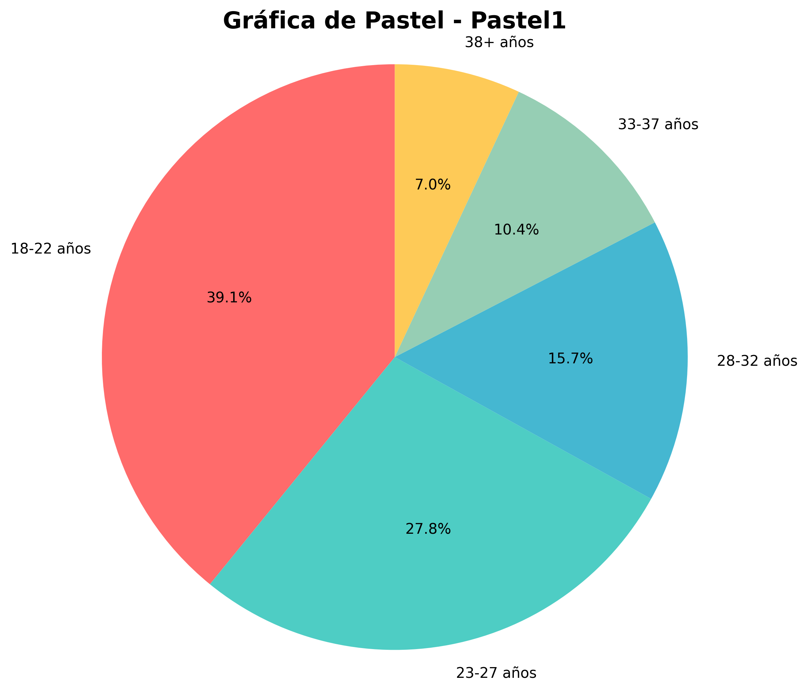
    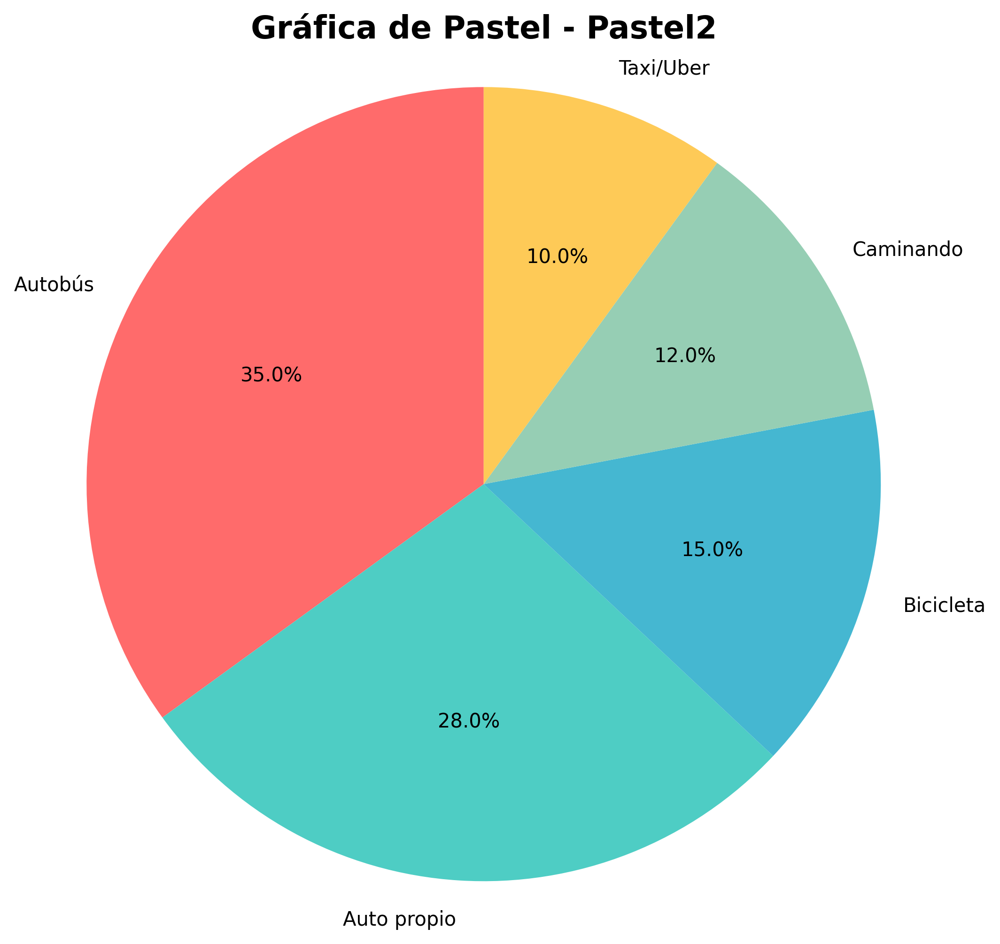
    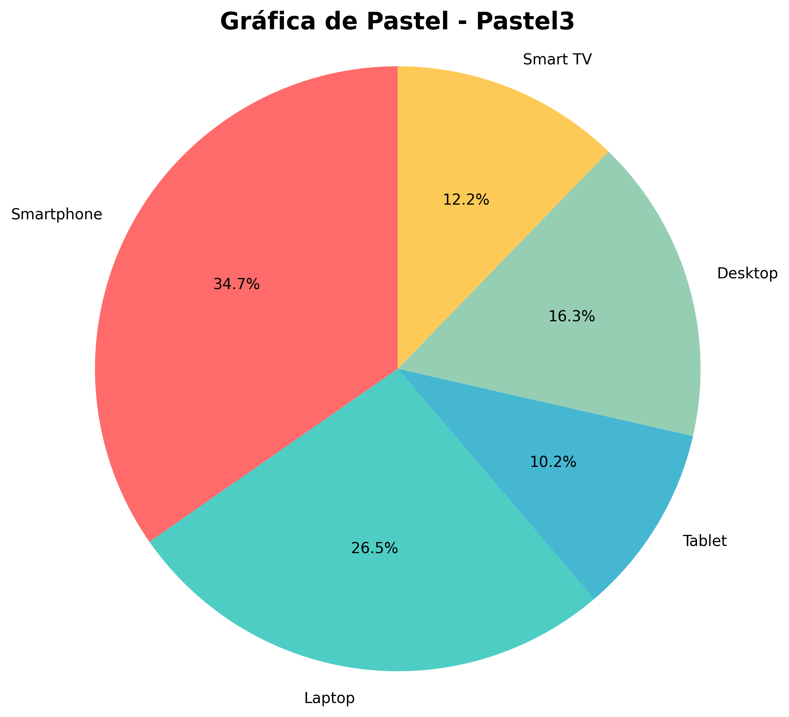
</figure>